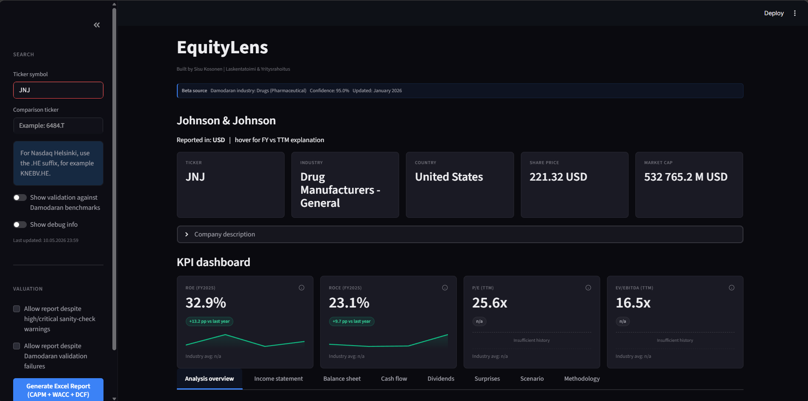
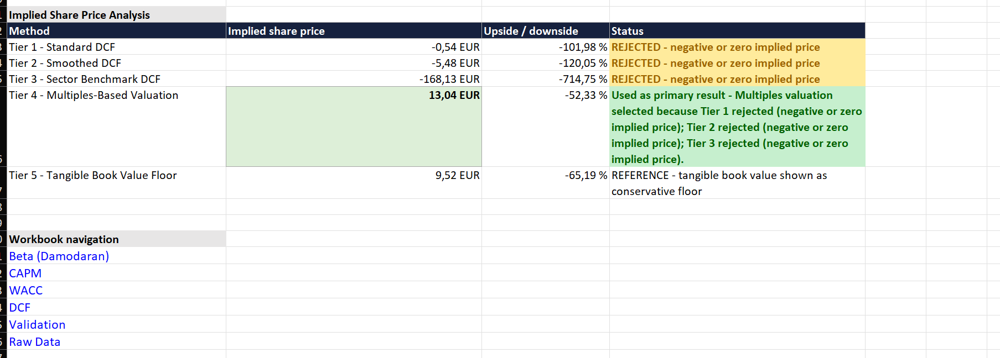
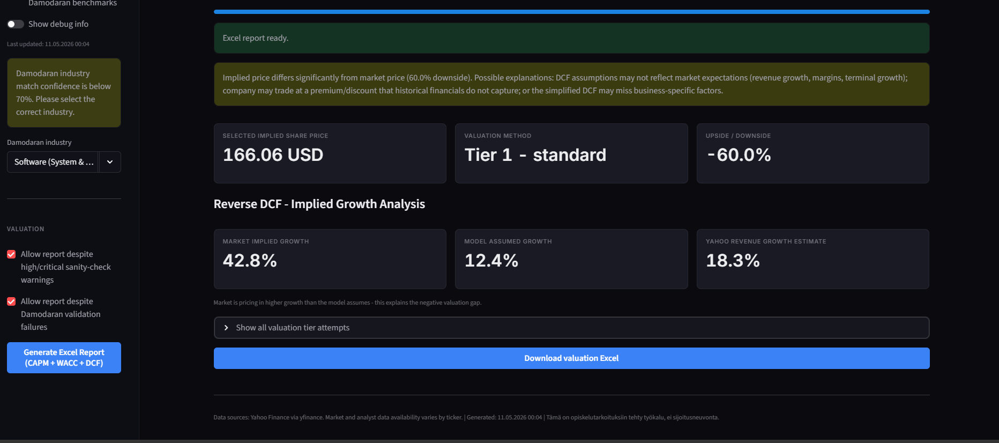
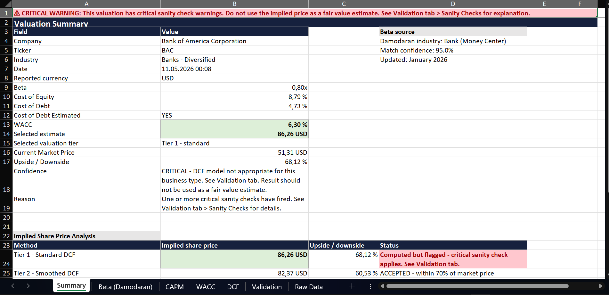

# EquityLens

A Streamlit app that pulls company financials from yfinance and produces a DCF valuation. The output is an interactive dashboard plus a downloadable Excel report with seven tabs: Summary, Beta, CAPM, WACC, DCF, Validation, and Raw Data.

> **AI-assisted development note.** This project was built with modern AI coding tools, especially Codex by OpenAI and Claude Code by Anthropic. I am not personally able to code a system of this complexity from scratch without assistance. The purpose of this project is to use these tools deliberately as part of my learning process: to build, test, question, debug, and understand a finance model more deeply than I could through theory alone.
>
> **Why this exists.** This is not meant to be a finished product. It is a learning journey where I built a data-driven valuation model and at the same time tried to connect it to the main theories in corporate finance: CAPM, WACC, DCF, sector benchmarking, and multiples. I wanted to understand markets and numbers more deeply than I did before.
>
> The model itself is deliberately conservative. It uses historical CAGR for revenue growth, the latest reported EBIT margin, and Gordon growth terminal value. I think of it as a "downside-anchored" framework. Instead of asking *what is the price target*, it asks *what does the historical financial trajectory justify?* The reverse DCF then complements this. It quantifies what growth assumption the current market price implies, which makes the gap between numbers and narrative visible.

---

## What it does

- Pulls company financials, share price, beta, and Yahoo trailing revenue growth data from Yahoo Finance via yfinance.
- Provides a side-by-side peer comparison view (radar chart, FY metrics table, TTM market multiples) for sanity-checking the valuation against a comparable company.
- Matches the company to a Damodaran (NYU Stern) industry sector. From there it pulls sector benchmarks for beta, cost of debt, EBIT margin, CapEx, and EV/EBITDA, EV/Sales, P/Book multiples.
- Re-levers the Damodaran industry beta to the company's capital structure.
- Builds CAPM cost of equity and WACC from company financials. The risk-free rate is matched to the company's reporting currency where available. Sector fallbacks fill in where company data is missing.
- Runs a 5-tier valuation cascade: Standard DCF, Smoothed DCF, Sector Benchmark DCF, Multiples, Tangible Book Floor. The first tier that produces a positive implied price within 70% of market is selected.
- Solves a reverse DCF. Given Tier 1 inputs, what year-1-to-5 revenue growth would make the implied price equal the current market price?
- Runs two parallel sanity-check pipelines. One gates Excel report generation when critical warnings fire. The other is informational only and writes to Excel.
- Detects business models where operating-company DCF is structurally inappropriate: banks, insurers, REITs, and asset managers. The report is blocked until the user explicitly overrides.
- Generates a downloadable Excel workbook. CAPM, Beta, and WACC sheets use auditable Excel formulas; DCF tier outputs and diagnostic sections are written as calculated report values.


*Main dashboard view (JNJ shown)*

## Tech stack

- Python, Streamlit
- yfinance for market data
- Damodaran NYU Stern datasets for sector benchmarks (US, Europe, Emerging, Global)
- openpyxl for Excel report generation
- LibreOffice headless for formula recalculation, with a graceful fallback if missing
- scipy.optimize.brentq for the reverse DCF solver
- rapidfuzz and difflib for sector matching
- Plotly for interactive charts
- pytest for unit tests

## Quick start

```bash
git clone https://github.com/<Sisukosoo>/equitylens.git
cd equitylens
pip install -r requirements.txt
python -m streamlit run app.py
```

Type a ticker in the sidebar (for example `JNJ`, `KNEBV.HE`, or `NESN.SW`), click **Generate Excel Report**, and download the workbook.

---

## Test results across 12 tickers

I tested the model across mature, growth, cyclical, transition, and out-of-scope business types. All results below are from a single run on 2026-05-10 against the same Damodaran data vintage (January 2026).

### Valuation output

| # | Ticker | Company | Share | Implied | Upside | Tier | Confidence |
|---:|---|---|---:|---:|---:|---|---|
| 1 | JNJ | Johnson & Johnson | 221.32 | 204.85 | -7.4% | 1 | NORMAL |
| 2 | KO | Coca-Cola | 78.42 | 61.90 | -21.1% | 1 | NORMAL |
| 3 | XOM | Exxon Mobil | 144.57 | 113.74 | -21.3% | 1 | NORMAL |
| 4 | KNEBV.HE | KONE | 51.14 | 34.47 | -32.6% | 1 | NORMAL |
| 5 | PG | Procter & Gamble | 146.42 | 99.58 | -32.0% | 1 | NORMAL |
| 6 | GOOGL | Alphabet | 400.80 | 180.24 | -55.0% | 1 | NORMAL |
| 7 | MSFT | Microsoft | 415.12 | 166.06 | -60.0% | 1 | NORMAL |
| 8 | AAPL | Apple | 293.32 | 98.74 | -66.3% | 1 | NORMAL |
| 9 | NESN.SW | Nestle | 77.47 | 91.42 | +18.0% | 1 | NORMAL |
| 10 | UNH | UnitedHealth | 379.98 | 429.58 | +13.1% | 1 | NORMAL |
| 11 | NESTE.HE | Neste | 27.35 | 13.04 | -52.3% | 4 | LOW |
| 12 | BAC | Bank of America | 51.31 | 86.26 | +68.1% | 1 (flagged) | CRITICAL |

### Reverse DCF and sector context

| # | Ticker | Reverse DCF implied growth | Tier 1 assumed | Yahoo trailing revenue growth | Damodaran sector |
|---:|---|---:|---:|---:|---|
| 1 | JNJ | 7.4% | 5.6% | 9.9% | Drugs (Pharmaceutical) |
| 2 | KO | 8.9% | 3.7% | 12.1% | Beverage (Soft) |
| 3 | XOM | -1.0% | -6.7% | 2.6% | Oil/Gas (Integrated) |
| 4 | KNEBV.HE | 11.4% | 1.0% | 1.3% | Machinery |
| 5 | PG | 8.9% | 1.7% | 7.4% | Household Products |
| 6 | GOOGL | 43.5% | 12.5% | 21.8% | Software (Internet) |
| 7 | MSFT | 42.8% | 12.4% | 18.3% | Software (System & App) |
| 8 | AAPL | 28.1% | 1.8% | 16.6% | Electronics (C&O) |
| 9 | NESN.SW | -4.0% | -1.8% | -2.2% | Food Processing |
| 10 | UNH | 9.3% | 11.4% | 2.0% | Healthcare Products |
| 11 | NESTE.HE | n/a (failed) | -9.6% | 2.9% | Green & Renewable Energy |
| 12 | BAC | -3.1% | 6.0% | 8.1% | Bank (Money Center) |

### What the table shows

**8 of 10 DCF-applicable operating companies trade above conservative DCF.** This is by design. With historical CAGR, latest-FY margins, and Gordon growth terminal, the model anchors on what already happened. Quality, brand, AI optionality, and other forward-looking factors are not in the inputs.

**UnitedHealth (#10) and Nestle (#9)** are the positive-upside cases among DCF-applicable tickers. UnitedHealth's market price has compressed below historical fundamentals, and Tier 1 still works because the inputs are within normal ranges. Nestle moved above market after the currency-specific risk-free rate fix. A CHF-denominated company should not be discounted with a US Treasury rate, and the lower CHF risk-free rate now flows through WACC correctly.

**Big tech (GOOGL, MSFT, AAPL)** show the largest gaps. Reverse DCF is what makes those gaps actually informative. MSFT, for example, needs **42.8% revenue CAGR** to justify $415, while the historical CAGR is 12.4% and the Yahoo trailing revenue growth is 18.3%. The model cannot generate that growth from its inputs, and that is the point. The gap is what the user is supposed to think about.

**Neste (#11)** triggered the full 5-tier fallback. Tiers 1, 2, and 3 all produced negative implied prices because Neste's latest-FY EBIT margin is only 1.8%, against a 5-year average of 4.6%. The company is in a transition trough. **Tier 4 multiples valuation** (median of EV/EBITDA, EV/Sales, P/Book) selected EUR 13.04. The reverse DCF solver could not converge, and instead returned an interpretation message: *"current Tier 1 EBIT margin (1.8%) is significantly below the 5-year average (4.6%), suggesting the market is pricing margin recovery rather than revenue growth."*

**Bank of America (#12)** triggered the business model compatibility check. Operating-company DCF is structurally wrong for banks. Deposits and loans are revenue-generating instruments, not products with predictable CapEx. The Excel report is generated only after the user explicitly overrides the critical warning in the sidebar. Confidence reads `CRITICAL: DCF not appropriate`.

---

## How the 5-tier fallback works

### Tier summary

| Tier | Method | Core inputs | Acceptance |
|---:|---|---|---|
| 1 | Standard DCF | Latest-FY EBIT margin, historical revenue CAGR, latest financial structure | Positive + within 70% of market |
| 2 | Smoothed DCF | 3 to 5 year averages for margin, D&A, and CapEx | Positive + within 70% of market |
| 3 | Sector Benchmark DCF | Damodaran sector EBIT margin, CapEx, and 2.5% growth | Positive + within 70% of market |
| 4 | Multiples Valuation | Median of sector EV/EBITDA, EV/Sales, and P/Book | Positive + within 70% of market + above 50% of tangible book |
| 5 | Tangible Book Floor | (Total equity − goodwill − intangibles) / shares outstanding | Used only when Tiers 1 to 4 fail |

### Skip and fallback logic

| Tier | Skip or special rule |
|---:|---|
| 1 | Not run if latest financials required for the DCF are unavailable. |
| 2 | Same data gate as Tier 1. |
| 3 | Skipped if Damodaran sector EBIT margin is non-positive. |
| 4 | Rejected if no positive multiple-based estimates are available. |
| 5 | Never skipped in the final fallback path; shown as a conservative reference floor. |

The first tier that produces an accepted result becomes the selected estimate. Tiers below the selected one are still computed and shown for transparency. The 70% acceptance band reflects my view that DCF is one input only. Beyond plus-minus 70%, the model is not really estimating anymore, it is extrapolating, and the user should rely on multiples or qualitative analysis instead.


*Neste case (Excel report view): Tiers 1-3 rejected, Tier 4 multiples valuation accepted, Tier 5 shown as reference floor*

## Reverse DCF

Reverse DCF is a **diagnostic tool**, not a valuation tier. It holds Tier 1 inputs constant (latest-FY margin, WACC, terminal growth, all working-capital and CapEx ratios). Then it solves for the year-1-to-5 revenue growth rate that would make the implied price equal the market price. The solver uses `scipy.optimize.brentq` with `xtol=1e-6, maxiter=100` over the range -10% to +50%. There is a deterministic bisection fallback if scipy is not available.

There are three output cases:

- **Case A (success).** The numeric implied growth is shown next to the model assumed growth and the Yahoo trailing revenue growth.
- **Case B (no convergence).** A failure message with diagnostic context. For example, when the current EBIT margin is below 50% of the 5-year average, the message flags that the market is probably pricing margin recovery rather than growth.
- **Case C (not yet computed).** Hidden until the valuation runs.

Reverse DCF is the most useful analytical output in this project. It quantifies the gap between the historical numbers and the market narrative. That is the gap the DCF cannot close on its own, because brand strength, AI optionality, switching costs, and regime changes are not historical line items.


*MSFT example: market price implies 42.8% revenue CAGR vs 12.4% historical and 18.3% Yahoo trailing revenue growth*

## Sector matching

Company industry strings from yfinance are mapped to Damodaran sector buckets in three steps:

1. **Curated mapping table** for known ambiguous yfinance labels. Examples include `banks - diversified` mapped to `Bank (Money Center)`, and `drug manufacturers - general` mapped to `Drugs (Pharmaceutical)`.
2. **Fuzzy match fallback** if no curated mapping applies. The app uses rapidfuzz `token_set_ratio` against all Damodaran industry choices, with `difflib` as a secondary fallback.
3. **Confidence threshold.** Matches above 70% are accepted automatically. Below 70%, the sidebar prompts the user to manually select an industry.

A curated mapping prevents specific known mismatches. For example, it stops pharma companies from accidentally matching `Insurance (General)` via shared generic words.

## Sanity checks: two parallel pipelines

EquityLens runs two separate check pipelines:

- **`run_sanity_checks()`** gates Excel report generation. Critical warnings block the report until the user explicitly overrides via a sidebar checkbox. This pipeline includes business model compatibility, default-assumption usage, beta and cost-of-equity and WACC ranges, the terminal growth >= WACC check, and the tax rate range.
- **`build_excel_sanity_checks()`** is Excel-only and informational. It includes margin volatility, cost-of-debt context, tax structure, beta methodology gap, margin assumption sensitivity (Tier 1 vs Tier 2), and the implied price vs market check.

The split is deliberate. Adding new informational checks does not change gating behavior, which means I can keep adding analyst-level commentary to the Excel file without risking false-positive blocks on the report.

## Business model compatibility check

Operating-company DCF assumes revenue from product or service sales, with predictable CapEx and working capital. That assumption does not hold for financial institutions, asset managers, or real estate vehicles. The model triggers a critical warning when the matched Damodaran sector contains any of: `bank`, `brokerage`, `insurance (life)`, `insurance (prop/cas)`, `insurance (general)`, `reinsurance`, `investments & asset management`, `r.e.i.t.`, `real estate (general/diversified)`, `real estate (operations & services)`, `real estate (development)`, `financial svcs.`, `securitized`.

When triggered:

- Streamlit displays a critical warning banner.
- Excel generation is blocked until the user checks the sidebar override.
- The Excel Summary tab shows a red critical banner at the top.
- Confidence reads: *"CRITICAL: DCF model not appropriate for this business type. Result should not be used as a fair value estimate."*
- Selected tier status reads *"Computed but flagged"*.

This was tested with Bank of America (case 12 above). The gating activates, the Excel banner renders correctly, and the user has to acknowledge the limitation before the report is produced.


*Bank of America (Excel report view): critical warning banner and "Computed but flagged" status*

---

## Known limitations and future improvements

This is a study project, not a production valuation tool. Below are the limitations I am aware of. I have decided not to fix them in this version. Some are deliberate design choices. Others would need structural changes that go beyond the scope of a learning project.

**1. Conservative terminal value framework.** Terminal value uses Gordon growth only, calculated as `FCF x (1 + g) / (WACC - g)`. There is no exit-multiple comparison. Combined with historical CAGR and latest-FY margins, this systematically anchors the model below market price for quality compounders like KO, PG, and the big tech names. A production-grade DCF would compute both Gordon growth and an exit-multiple terminal value, and present a range. I went with the conservative path on purpose. It keeps the model interpretable as a single anchor and makes the reverse DCF gap meaningful.

**2. Historical CAGR cannot capture transition stories.** AI momentum, platform shifts, brand pricing power, regulatory change, and management quality are not historical line items. The big tech reverse DCF results (MSFT 42.8%, GOOGL 43.5%, AAPL 28.1%) quantify how much of the current market price is non-fundamental expectation. The model's job is to measure that gap, not to close it.

**3. Sector matching is approximate.** Matches above 70% confidence are accepted automatically. Below 70% the user is prompted to override. This works cleanly for pure-play companies. JNJ matches `Drugs (Pharmaceutical)` at 95%. But it can mismatch hybrid business models. UnitedHealth matches `Healthcare Plans` to `Healthcare Products` at 76.9% confidence, even though UNH is primarily an insurance plan provider. The match clears the 70% threshold so no manual review is requested. A future improvement would be an info-tier warning for matches in the 70% to 85% confidence band, prompting verification without forcing override.

**4. Cyclical companies show large Tier 1 vs Tier 2 gaps.** Tier 1 uses the latest fiscal year, which can be a cyclical trough or peak. XOM is a clear example. Tier 1 implies $113.74 using the cyclical-low FY2025 margin of 12.9%. Tier 2 implies $180.15 using the 14.5% three-year average margin. The sanity-check pipeline flags this as "Margin assumption sensitivity" but does not change the selected tier. A production tool might either select between Tier 1 and Tier 2 based on margin volatility, or just present both as a range.

**5. Reverse DCF holds margins constant.** When the current margin is far from the historical average, the reverse DCF can fail to converge. Neste is the example. Current EBIT margin is 1.8% versus a 5-year average of 4.6%. The solver returns a diagnostic message instead of a number. That message is useful, but it is not a quantified answer. A more sophisticated reverse DCF would optionally solve for a margin recovery path instead of for growth.

**6. Other valuation approaches are not implemented.** Dividend discount, sum-of-the-parts, residual income, and embedded value models are not in the project. The model is operating-company DCF only. The 5-tier fallback recognizes when the framework does not apply, like Neste's negative DCF tiers triggering Tier 4 multiples or BAC's business model gating. But it does not automatically reach for the right alternative method when DCF fails.

These are all listed as `known_limitations`, not `bugs`. They reflect deliberate scope decisions for a learning project focused on methodology and reflection, not on producing investment-grade price targets.

---

## Data sources and acknowledgments

- **Yahoo Finance via yfinance** for company financials, share prices, betas, USD Treasury yield data, and trailing revenue growth data.
- **Aswath Damodaran (NYU Stern)** for industry datasets covering currency-specific risk-free rates, betas, WACC, EBIT margins, CapEx ratios, and valuation multiples. The model picks the regional dataset matching the company's listing (US, Europe, Emerging Markets, or Global).
- **scipy** for the reverse DCF solver (`brentq`).
- **rapidfuzz** for sector matching.

The Damodaran data is downloaded from `pages.stern.nyu.edu/~adamodar/pc/datasets/` and refreshed in January each year. All sector benchmarks shown in the model are from January 2026.

---

## Disclaimer

This is a study project, not investment advice. Valuation outputs are mechanical computations from public data, not analyst recommendations. Use at your own risk.

Built by Sisu Kosonen as a portfolio project and a learning-by-doing exercise.
